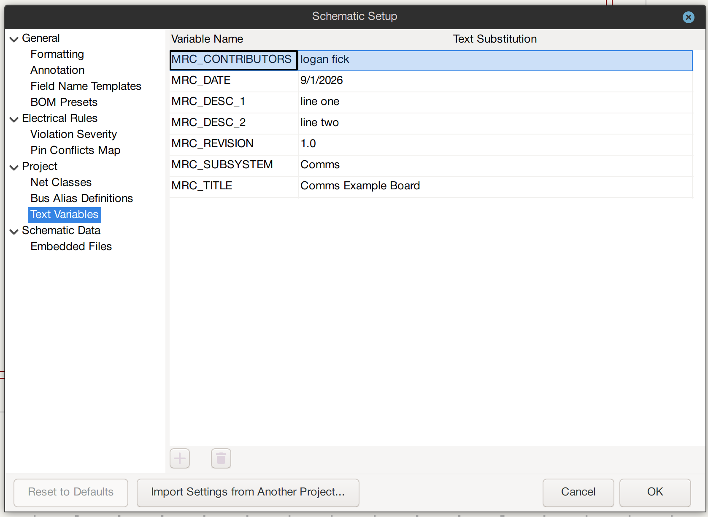

<div align="center">
    
</div>

# BU Mars Rover Club Electrical Team KiCad 10.0 Project Template

This repository is a template for the electrical team to use for board design. It can be easily cloned, edited, and uploaded to the club github for collaboration between members.

## File Structure

- ```/kicad/``` contains all of the KiCad 10.0 project files
- ```/datasheets/``` should contain all of the .pdf files for the important components
- ```/calculations/``` should include any significant calculations that led to a component choice or value choice

## Using this Template in KiCad 10.0

Download KiCad [here](https://www.kicad.org/download/). We are using version 10.0 for the club this year.

1. Clone this repository.

2. Open up KiCad 10.0 and open the default project in the ```kicad/default``` directory.

3. Click ```save as``` and save it to the ```kicad``` directory under the name PROJECT_NAME.

4. Delete the ```kicad/default``` directory.

5. Open up your newly renamed project, and then open the schematic editor.

6. Click ```File -> Schematic Setup```, then under ```Project -> Text Variables```, populate all of the fields with the correct information such as ```contributors``` and board ```revision```. Then click OK and you should see the bottom right of the schematic and layout correctly update. See a screenshot below:




8. Edit this README.md file, initialize the git repository, and start working on your project!
